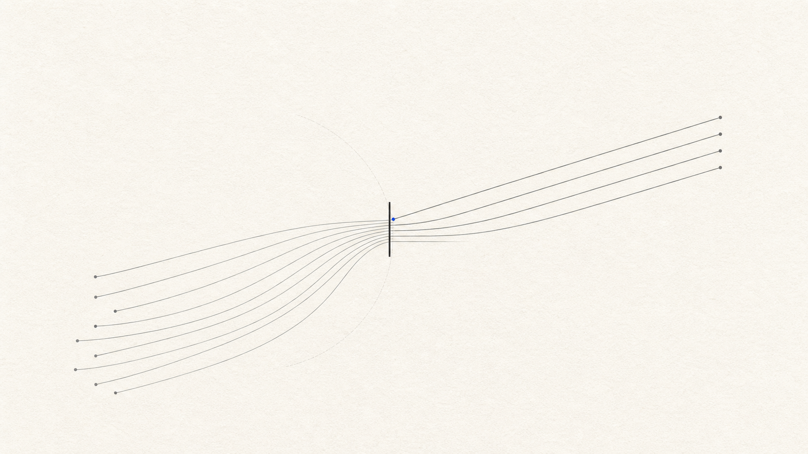
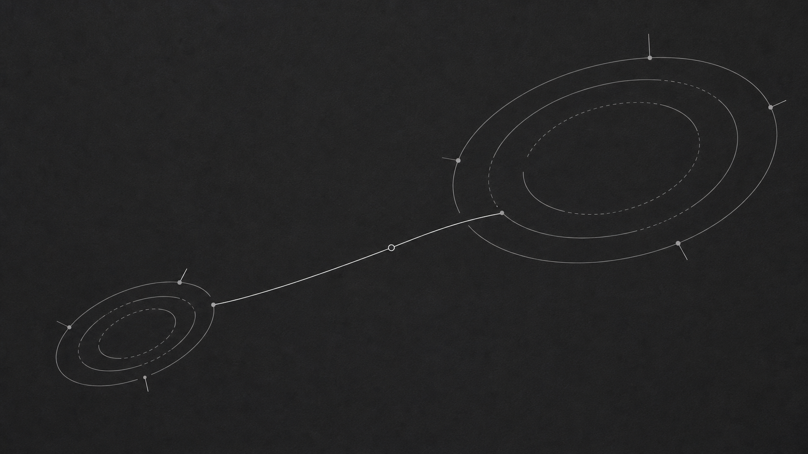
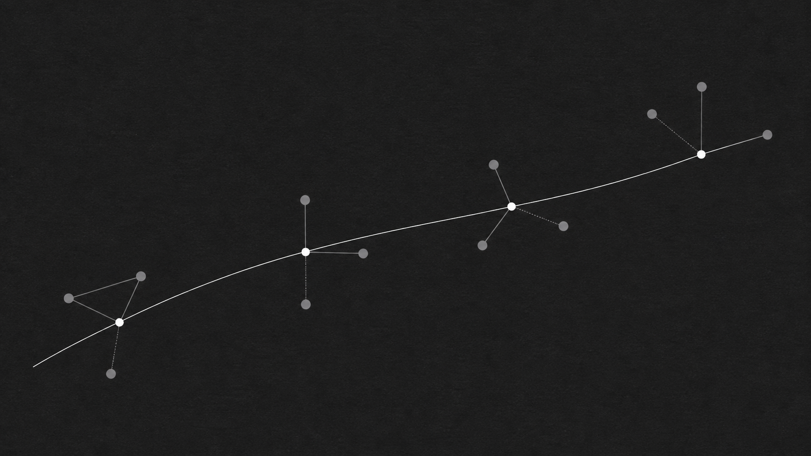
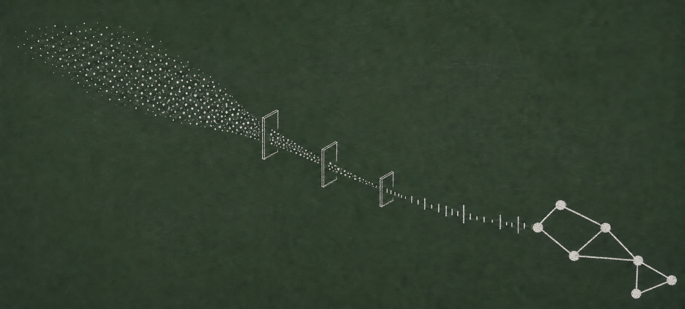
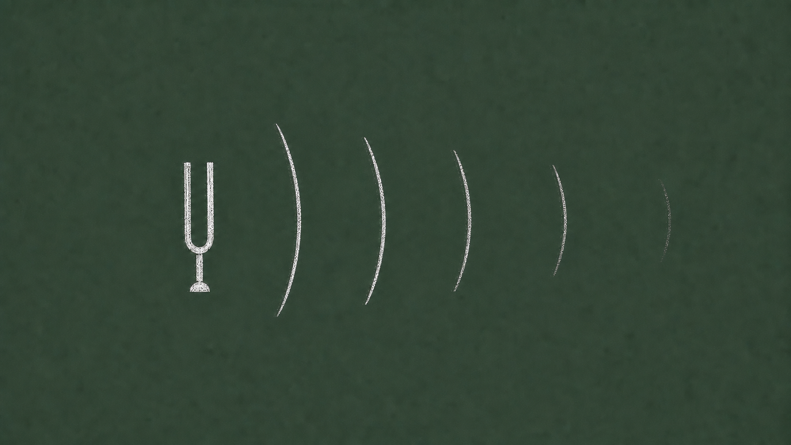
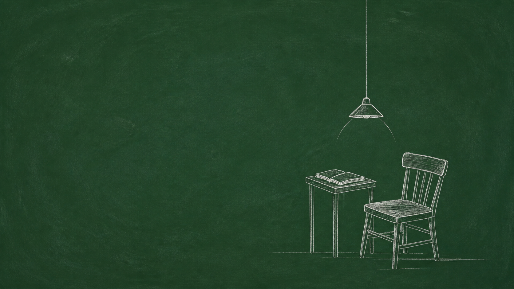

# Skills

A collection of Agent Skills by Cali Castle. Currently includes Signal Geometry and Chalk Logic.

[](https://skills.sh/calicastle/skills/signal-geometry)

## Signal Geometry

Signal Geometry is an Agent Skill for turning one concept into a sparse abstract illustration or poster. It uses precise geometry, quiet matte fields, restrained contrast, and one legible spatial event.







### Install

Using npm:

```sh
npx skills add CaliCastle/skills --skill signal-geometry
```

Using pnpm:

```sh
pnpm dlx skills add CaliCastle/skills --skill signal-geometry
```

### Use

Invoke the skill explicitly with `$signal-geometry`:

```text
Use $signal-geometry to create a dark 4:5 poster about a weak signal becoming stable through repeated filtering. No text.
```

For a prompt without rendering:

```text
Use $signal-geometry in prompt-only mode for an ultrawide illustration about two systems finding equilibrium.
```

### Output

Rendered work includes the accepted image, its exact final prompt, and the complete composition recipe. Prompt-only mode returns the prompt and recipe without generating an image.

### Requirements

- Prompt-only mode works without image tools.
- Rendered mode requires image generation and image inspection capabilities.
- The Codex integration is explicit-only by design, so invoke `$signal-geometry` by name.

### License

Signal Geometry and its reference images are released under the [MIT License](LICENSE).

## Chalk Logic

Chalk Logic is an Agent Skill for turning one concept into a quiet, wordless white-chalk illustration on a desaturated green board. It supports explanatory systems, natural processes, observed objects, and sparse editorial scenes without drifting into classroom clutter or polished digital graphics.







### Install

Using pnpm:

```sh
pnpm dlx skills add CaliCastle/skills --skill chalk-logic
```

Using npm:

```sh
npx skills add CaliCastle/skills --skill chalk-logic
```

### Use

Invoke the skill with `$chalk-logic`:

```text
Use $chalk-logic to create a quiet 16:9 wordless illustration about a heavy thought becoming easier to carry.
```

For a prompt without rendering:

```text
Use $chalk-logic in prompt-only mode for a portrait illustration explaining how a key opens a lock. No labels.
```

### Output

Rendered work includes the inspected image, its exact prompt sequence, the complete composition recipe, and QA status. Prompt-only mode returns the compiled prompt and recipe without generating an image.

### Requirements

- Prompt-only mode works without image tools.
- Rendered mode requires image generation and image inspection capabilities.
- Image-free conversations route generation and inspection through an isolated worker and return file links only.

### License

Chalk Logic and its reference images are released under the [MIT License](skills/chalk-logic/LICENSE).
